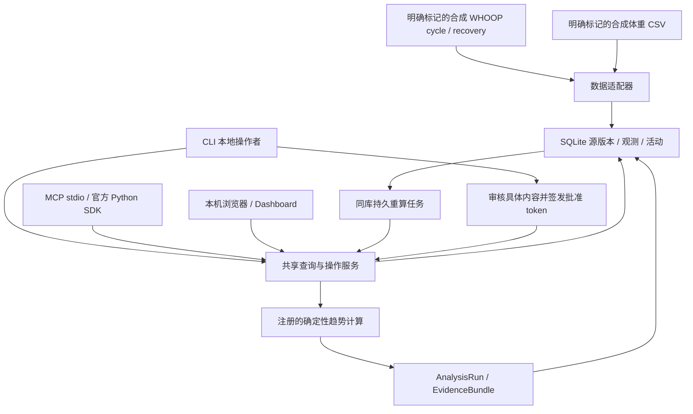

# F0 / F1 / F2 实现架构

日期：2026-09-07。本文描述当前源码的能力和边界；设计取舍见 [DECISIONS.md](DECISIONS.md)，官方资源依据见 [WHOOP_RESOURCES.md](WHOOP_RESOURCES.md)。最初架构审查材料仍作为设计输入保留，不能把其未来要求视为当前已交付功能。

当前是 Python 3.11+、每个环境一个 SQLite 数据库的本地模块化单体。默认 `synthetic` 使用标准 SQLite；
用户明确授权后，`real` 使用 SQLCipher 和独立路径。两者复用同一持久层，不是两套业务数据库实现。
CLI 和 F2 本机浏览器可访问本人获准的真实库；MCP stdio 仍仅开放合成环境。
Dashboard 只监听 127.0.0.1，OAuth 回调在另一个本机端口临时运行，没有公开 Web API。

## 模块职责

| 模块 | 当前职责 |
|---|---|
| `contracts.py` | 来源无关的源记录、观测和活动输入结构；带时区时间戳与有限数值校验 |
| `adapters.py` | 解析合成 WHOOP 配对记录和体重 CSV，映射指标、原单位和时间语义 |
| `storage.py` | 建库及版本校验、事务导入、源版本快照、持久任务表和 SQLite 备份 / 恢复 |
| `analytics.py` | 指标定义与计算注册表；当前算法为 `mean_change/1` |
| `service.py` | 分析请求校验、快照、缓存、证据、复算与任务领取 / 执行 |
| `commands.py` | 本地训练草稿、修改提案、批准、提交、撤销和审计 |
| `cli.py` | 本地操作命令、导入、查询、执行任务、批准与备份入口 |
| `mcp_server.py` | 将相同应用服务公开为 MCP 工具，不复制业务算法 |
| `protection.py` / `credentials.py` | SQLCipher 与本地存储政策；OS Keychain 密钥/凭据和进程锁 |
| `oauth.py` / `whoop_client.py` | Authlib 授权及串行轮换；HTTPX 官方只读端点、分页、限流与有限重试 |
| `api_ingestion.py` | 固定 OpenAPI 校验、六种个人资源完整原文与选定指标规范化 |
| `identity.py` | WHOOP UUID 规范身份、独立重放键与保留原证据的别名迁移 |
| `exports.py` | CSV/ZIP 结构检查、显式列/单位/时间映射，provider 与 API 分离 |
| `sync.py` / `live_cli.py` | 加密分页暂存与断点；本地应用配置、回调、同步和清理入口 |
| `dashboard.py` | 固定六指标视图、7/30 天窗口、未评分/缺失状态、精简来源详情；复用注册分析与版本选择 |
| `briefing.py` | 将既有三项官方概览和注册统计投影为每日摘要；无数据访问、新评分或模型调用 |
| `weekly.py` | 当前保留记录的 UTC 日历周投影；复用六指标与 mean_change/1，整体一致性读取和来源分页 |
| `cycles.py` | 按官方周期/睡眠 ID 关联当前保留源，投影既有官方观测及来源；整页一致性与分页 |
| `journal.py` | 已明确映射的当前 Journal 问答与来源投影、日期分页；复用官方指标视图并列当天记录 |
| `web.py` / `web_assets/` | Starlette/Uvicorn 本机 HTTP、会话/同源检查、按需/手动同步线程；原生 HTML/JS 和本地 Chart.js |
| `dashboard_demo.py` | 从随包合成 fixture 生成演示窗口；拒绝真实环境 |

MCP 的查询工具可以保存分析缓存与证据；“查询”指不更改源数据或训练计划，并不表示完全没有内部持久化。协议注解辅助客户端理解用途，真正的版本、批准和幂等检查在应用服务中执行。

## 来源、版本和身份

建库时生成独立的内部 `subject_id`。`source_connections` 把提供方、外部账户和该内部身份关联；当前每个 provider 只有一个连接，不是多账户或多租户设计。WHOOP `user_id` 只作为来源账户依据，不作为整个应用的个人身份。一个导入包不能混入多个 WHOOP 外部用户；连接建立后也拒绝同一 provider 切换外部账户。

WHOOP 适配器将一条 recovery 与其完整 cycle 配成一个源版本，保存原始两条记录、解析器版本、元信息和内容哈希。两者修改时间分别作为版本分量，较晚值作为组合记录的来源修改时间，因此周期区间或时区变化也能形成新版本。新组合不能出现一个分量前进而另一个退回；整体落后的来源记录可保留为历史材料，但不成为当前版本。F1 另保留独立 cycle、sleep、workout、profile、body 响应；活动表保存前三类的区间，复杂睡眠阶段、训练分区与运动名称等保留完整原文。未实现训练组次模型。

`observations` 引用对应源版本，保留指标、规范值 / 单位、原值 / 单位、时间区间、时间精度、质量和来源指标属性。本轮映射 WHOOP 的 HRV、恢复分、静息心率、血氧和皮温；只有 `SCORED` 记录生成观测，缺字段不补零，校准期观测标为 `calibrating`。这里的“官方”表示指标定义来自 WHOOP，样例数值仍是合成数据。

体重 CSV 使用独立 provider `manual`，目前只支持 `body.weight` 的 kg / lb 输入，并统一为 kg；保留输入值和输入单位。它不依赖 WHOOP cycle，也不是已兼容 WHOOP 官方导出格式的导入器。新增指标需要注册定义及必要的适配逻辑，当前未开放任意指标、任意单位解析。

F1 导出适配器使用 `whoop_export`，由显式 profile 定义四类资源的实际表头、身份列、单位与时区。
官方未公布完整表头契约，示例为合成而非真实导出验证。身份仅由资源与明确身份列决定；
独立时间列修正不产生新身份。若用户只能以时间本身识别记录，则无法保证修正匹配，不能伪造官方 ID。
导出时间是用户提供的快照版本时间，不是提供方修改时间；没有账户 ID 时保持未知。
API 的 profile/body 也没有提供修改或测量时间，其捕获时刻仅用于版本，不生成带虚构测量日期的观测。

首次真实联调发现 WorkoutScore 的 `distance_meter`、`altitude_gain_meter`、`altitude_change_meter`
可能返回 null。官方契约描述三者为可选字段；验证副本将这三项空值视为缺失，原始响应完整保留 null。
没有放宽必填项或非空类型校验，也没有填零；官方 OpenAPI 快照保持原样。

导入首先完成解析，再用一个数据库事务写入一批版本和规范记录。版本身份由连接、资源、外部 ID 及输入内容哈希共同决定，重复内容不重复写入；单纯重复采集的 `captured_at` 不参与内容指纹。已知不同内容作为不同版本保留。源记录模型支持逻辑删除标记；F1 另提供到期清理与明确的本地来源删除，尚无 WHOOP 删除事件接入。

## 时间快照与分析证据

系统区分三种时间：观测的 `start_at` / `end_at`、来源的 `source_updated_at`，以及应用首次接收版本的 `known_at`。`known_at` 由本地应用时钟生成，导入拒绝倒退到已有知识时间之前。导入时记录该版本是否成为当时的当前版本（`became_current`）；历史查询先限定 `known_at <= as_of`，再为每条来源记录选择当时可见且曾成为当前版本的最后一次版本。后来导入的旧资料不会自动成为应用过去已知的信息，也不会覆盖已接收的较新来源状态。

指标查询窗口使用 UTC 与 `start_at ∈ [start,end)`。WHOOP 恢复值在 F0 按关联 cycle 的起点进入窗口，保留整个 cycle 区间；这不是按用户当地日历日或恢复记录修改日分组。若请求早于首次采集历史，证据明确提示更早状态未知。F2.3 Journal 按来源日历日期筛选，另以明确时区的当日边界并列指标，见下节。

分析只接受注册指标和算法，限制窗口不超过 366 天、观测不超过 10,000 条；这些是当前实现的计算上限。
若同一查询出现多个 provider 或资源类型，服务要求明确选择，避免合并 API/导出或周期/单次训练。
存储单位须与指标注册定义一致；F1 直接映射官方负荷、能量、睡眠表现/效率/一致性和呼吸率等标量。

`mean_change/1` 将窗口按时间等分为前后两半，计算均值、最小值、最大值、数量和后半均值减前半均值。只有 `quality=valid` 的观测参与；不插补缺失、不做时间加权。两半各至少两个有效观测时标为描述性结果，否则标为数据不足。没有因果推断、统计置信概率、临床判断或新的 WHOOP 评分。

每次分析保存 `AnalysisRun`：请求、来源目录位置、输入版本 ID、算法版本、结果、创建时间和 `stale` 状态。`EvidenceBundle` 包含规范观测、来源版本引用、哈希、解析器版本、来源修改 / 获知时间、单位和限制；`model` 与 `prompt_version` 为 null。

相同快照、参数、单位和算法版本可返回同一分析。复算按原始输入版本和当前可用的同版算法执行，核对来源版本存在且哈希相符，并比较结果；它不会偷偷换用最新源数据。源版本缺失或算法版本不可用时应明确失败。这是本地版本可复算机制，不是防止有同等文件权限的进程篡改数据库的密码学证明。

## 源修正与持久任务

导入成为当前的新源版本时，事务内按 provider、resource 和新旧观测的指标并集使相关显式分析失效；
未指定 provider/resource 的请求按通配处理，`as_of` 历史分析保留。profile/body 无指标变化不触发无关失效。
待处理重算请求合并，运行中的任务若遇新修正仍保留后续任务；每批最多 100 请求，不排空任务。
尚未按时间窗口精确失效；输入版本签名未变时可以复用缓存。重新查询也能直接计算最新快照。

任务与业务数据放在同一个 SQLite 中，带幂等键、执行状态、尝试次数、租约和租约 token。领取使用写事务；进程中断后，租约过期的任务可重新领取。完成时校验 token 与租约时间，旧持有者不能提交任务完成状态；重算本身复用分析缓存。

CLI `work` 每次执行有界批次，默认最多处理 20 项。它不是常驻守护进程或定时同步服务。失败任务保留失败状态和错误，目前没有自动退避、失败重试策略或远程消息系统。

## 本地训练操作与批准边界

训练草稿是本应用的计划文本，不代表已完成运动，也不是用户已确认的健康事实。创建草稿时保存 version 0 的计划与待批准动作；修改活动计划时创建提案，并保留计划原内容。每条提案绑定目标、预期版本、具体内容、作用范围 `local_training_plan:write`、风险类别与幂等键。

CLI 本地操作者查看提案后，通过交互输入完整 `payload_hash`，或显式传入已审核的 `--accept-hash` 批准。后端生成有期限的随机 token，仅持久化其哈希，并将批准与内容哈希、目标、版本及 scope 绑定。再次批准会轮换 token。提交在一个事务中校验批准、期限、撤销状态与目标版本，准确应用已批准内容；重复提交返回原结果。已提交动作不能撤销为“未发生”，需要另提修改。

MCP 提供合成环境的指标 / 分析 / 复算、草稿、修改提案、计划 / 动作查询，以及持 token 的提交工具；没有 `approve` 工具，也没有导入、备份、执行 worker 或 WHOOP 写入工具。MCP 不能通过自填 `approved=true` 获取批准。真实库不会因为本地存储授权就自动开放给模型。

批准依赖本地操作者这一信任边界。它不是独立的人类身份认证；拥有同一账号 shell 或数据库写权限的调用方也能运行批准命令或修改文件。若后续让模型拥有通用 shell，需要在宿主权限和流程中单独处理批准权限，不能仅凭“不注册 approve 工具”就宣称已隔离该能力。

## 可靠接入与持久化

SQLite 启用外键、WAL 和等待锁超时；业务写入采用事务。schema 3 支持从 F0 schema 1 经 2 的迁移，
打开时校验应用标识、版本与环境。真实库必须有 32 字节钥匙串密钥和本地所有者授权，禁止明文回退。
SQLCipher 保护数据库及 WAL，临时计算使用内存；SQLCipher 的社区 Python 包装不冒充官方商业支持。

OAuth 使用 Authlib，client secret、token 和短期 state 存在专用 OS Keychain 项；刷新在跨进程锁中完成。
state 一次性且有期限，回调严格匹配；代码交换或轮换响应丢失时要求重新授权，不盲目重发旧凭据。
HTTPX 只请求固定 WHOOP HTTPS 地址，不跟随跳转、不继承代理环境。GET 对 429/5xx 有限重试；
超出等待预算会暂停。分页保留窗口、游标和白名单策略/限流头，凭据、完整请求和 Cookie 不进入暂存。

`sync_runs` / `sync_pages` 保存每页结果与游标，单数据库同步通过进程锁串行。
六资源下载完成才规范化入库；必要时补取恢复引用但不在周期列表中的 cycle。
页面采集时间与领域入库的 `known_at` 分开保存。保留期按每类资源最早页面采集时间保守计算，
配对恢复/周期采用两者较早采集时刻；中断续传和重复导入不重新延长已有版本期限。
到期清理、身份判重及写入使用同一写事务时刻，过期旧版不吞掉仍有效的新采集。
当前胜出版本若先于其前驱到期，同身份前驱一并失效，避免旧值或已删除记录回退；不延长原期限。
中途失败保留断点，已入库但未标完成时重放仍去重。API 覆盖与复杂字段保留状态见 [验收](ACCEPTANCE.md)。

备份继续复用 SQLite backup API；真实备份使用 SQLCipher，可独立加密到目标密钥。备份/恢复均不覆盖已有文件。
真实来源版本有 `expires_at`；打开库及分析读取时清理过期源记录、派生缓存和相关任务，
到期暂存整批移除。明确删除来源同时清理其原文/规范值及受管备份；自主计划保留。
受管备份登记路径、设备及 inode，替换过的文件拒绝自动删除。恢复保留到期时间并拒绝过期内容。

应用退出时不会主动清理。独立副本、原导出、系统快照/备份不在清理清单；本机钥匙串的跨设备恢复尚未实现。
缓存失效/删除采用保守范围，可能清除其他来源的可重算分析，其他来源的领域记录保持。

首次实际 WHOOP 授权、Keychain 访问、六资源小窗口同步与本地复算已于 2026-09-07 通过。
随后真实令牌刷新及六资源 30 天请求窗口也已通过；不代表每个日期或字段都有记录。
自动化保护验证仍使用合成内容、测试密钥与模拟 HTTP；真实撤销、CSV、完整历史对账与恢复演练尚未完成。
没有 webhook、常驻调度、真实模型外发授权、完整用户上下文管理、通知或生产部署。
完整 API 原文字段不代表每个字段已有规范查询和教练逻辑；部署与真实对账仍须独立验收。

## F2 本机浏览器适配器

`dashboard` 默认合成，`--environment real dashboard` 只打开已有获准 SQLCipher 库。
进程启动读取专用 Keychain 密钥到内存，每个 HTTP 工作线程和同步线程分别打开同一路径的 Store，
不共享 SQLite 连接、不复制到普通 SQLite，也不新增 schema。关闭进程会停止服务。

HTTP 绑定固定 `127.0.0.1:<port>`，拒绝其他 Host、非回环客户端和不同 Origin/Sec-Fetch-Site。
首页签发进程级 HttpOnly/SameSite=Strict 会话，数据 API 需该 Cookie；同步 POST 额外要求精确 Origin、
随机 CSRF 头、JSON 白名单与 2 KB 请求上限。所有响应 no-store、禁止嵌入、资源只加载同源，
没有 CORS、任意文件/SQL/命令、配置、凭据或完整原文接口。禁用访问日志，意外错误不记录原始异常。
这是本地进程信任边界，不提供同机其他程序/OS 用户之间的独立身份认证，也不适合直接代理到公网。

GET `/api/dashboard` 返回三个概览及一项趋势，GET `/api/evidence` 返回指定观测的精简来源，
GET `/api/status` 返回连接和最近同步状态，POST `/api/sync` 发起或继续一个有界六资源同步。
F2.2 在打开时由浏览器发起一次带 `if_stale: true` 的同步 POST，也保留用户点击同步与续传。
GET 不发起同步。状态轮询、窗口/指标切换不会再次自动采集，没有调度器或 Webhook。
工作线程采用原 SyncService 的进程锁、分页预算和持久断点；延迟构造客户端，工厂失败也留断点。
服务端先验证本机授权与存储来源，再于共享进程锁内复查适用成功请求和最近断点，避免多页面/进程重复采集。
最近任务以数据库插入顺序确定，避免系统时间回拨掩盖新失败；其他进程成功恢复后，旧进程错误会解除。

新鲜度只依据成功请求：历史起点覆盖当前窗口，保守时间取请求结束、首次采集和完成时间三者最早值，
与当前时间相差不足 30 分钟且无未来时钟时为近期同步。检查所有成功请求，7 天请求不能代替 30 天请求。
该策略不依赖健康数值/记录日期数，也不保证 WHOOP 已更新或已评分；恢复旧请求不会被完成时间刷新为新请求。
前端在阈值到达时只更新提示文字，不发网络请求；状态检查时间另行显示。
未完成断点阻止自动尝试，由操作者继续原窗口或新建当前窗口；首个页面失败、没有暂存页的断点也按创建时间到期。
到期同步元数据、受管备份和备份恢复校验保持一致，不延长原采集记录保留期限。

7/30 天为最近 7/30 个 UTC 日期，结束于当前时刻；按记录起点进入半开窗口。
恢复沿用关联 cycle 的时间归属。当前源版本选择与 CLI/MCP 共用 SQL，概览保留最新未评分/校准状态，
不回退旧有效分数。曲线逐条保留观测，缺失日期放空点；同日训练没有被合成官方日均值。
均值/前后半窗口差值由同一 `CopilotService.analyze` 产生并保存证据，前端只格式化。
F2.1 为各指标提供窗口内 `coverage` 元数据：最早/最晚记录起点、按 UTC 去重的有记录日期数、
记录条数、有效观测数和各评分状态数量。其范围包含未评分记录，仅描述当前采集结果，
不是佩戴起点、佩戴天数或逐日完整覆盖证明。日期范围和同步成功请求范围分别展示。
空态分为没有记录、存在记录但无有效观测、有有效观测；前两种不画零值曲线。
同步错误、状态请求错误与趋势请求错误分别保留，避免并行加载时互相掩盖。
来源详情保留官方原值与单位，区分记录更新、关联周期更新、组合版本排序、采集和获知时间。

界面使用随包 Chart.js 4.5.1 UMD（MIT，来源与哈希随包保存）；不引入 CDN、追踪、模型或真实 WebMCP。
服务读取执行既有到期清理；响应和 DOM 仅驻本机浏览器内存，不写 localStorage。
已打开的页面仍可能显示先前读取的内容，关闭/刷新才释放或替换该视图；不宣称远程擦除浏览器内存。

## F2.3 Journal 导出与只读投影

沿用 `exports.py` 的 CSV/ZIP 预算、显式映射和事务导入，不新增表、解析库或网络采集。
mapping v2 仅适用于 Journal：明确稳定身份列、长表或宽表问答、日期依据、时间精度、时区，
以及操作者对同一本地 subject 的确认。回答列不得作为稳定身份。该确认不等于 OAuth 核验导出账户；
`whoop_export` 仍与 API provider 分离。v1 原始日志保留，未映射内容不猜测展示。

原始行和归一化 `payload.journal` 在同一源版本中保存。仅日期输入保留原日历标签，
`source_at` 为 null，不产生观测或活动；`day_start/day_end` 只是比较边界。时间点必须包含时分，
显式偏移优先；IANA 时区边界处理夏令时及缺失午夜，不将当地日期转换成另一天的 UTC 标签。
导出时间由调用者提供，仅作为快照版本排序时间；本地获知时间单独保存。

GET `/api/journal?days=7&page=1` 与 `/api/journal/evidence?revision=…` 使用已有会话、同源、
错误脱敏和 no-store 边界。投影仅含映射问答、日期和必要来源信息，不含整行、未映射列、
文件路径或身份列。仅选择当前有效 `whoop_export/journal`；读取结束复查清理和源目录位置，
并发变化时重读，旧版、删除或到期证据不能通过直接请求恢复显示。

最近 7/30 个日期标签用于筛选 Journal，每页 20 条，当前记录上限 10,000；每行最多 128 个问答，
问题 1,000 字符、回答 8,000 字符、导入文本总计 64,000 字符。前端使用 textContent 呈现原文，
空白回答为未填写，不将自述转换成事实判断。每组日期与时区的半开区间复用 `DashboardService`
读取 API 恢复/睡眠/周期负荷，显示按原测量起点筛选的最近记录，保留未评分状态。
这些是并列记录，不表示行为影响或 WHOOP 的 Journal Insight，既有 UTC 趋势语义不变。

Journal 经可信本地 CLI 导入后刷新；API 同步及其新鲜度不代表日志更新。
更新继续沿用源版本去重、修正和到期机制，新快照缺少旧行不自动表示删除；本地清除仍按整个
`whoop_export` 来源执行，不提供单条日志编辑/删除接口。原始下载文件、独立副本和系统快照不在受管清理内。
真实 Journal 导出兼容性尚未验收，示例均为合成；实际操作见 [JOURNAL.md](JOURNAL.md)。

## F2.4 每日摘要与近期变化

GET `/api/dashboard` 增加 `briefing`，由 `build_daily_brief` 从同一次读取的三张卡片投影。
包含查询截止时间、UTC 日历标签、各项今日/此前/无记录状态、当前源版本引用、开放周期标志，
以及原注册 mean_change/1 的分段均值/数量、分界、分析 ID 和可比较差值。不新增端点、数据表或依赖，
不访问 Journal。生成摘要后再执行到期清理与源目录一致性检查，变化时整体重读。

今日状态按记录测量起点的 UTC 日期判断，恢复使用关联 cycle 起点，各项可能来自不同日期。
睡眠沿用原 sleep 集合，可能包含 nap。周期无 end 或 end 晚于查询截止时标为尚未结束；
官方当前值继续保留，不重算或宣称全天最终负荷。统计仍沿用既有全窗口有效观测，包含开放周期当前值，
界面明确这一口径。最新未评分状态与此前已评分样本的比较相互独立。

原 mean_change/1 两半各一条时也可能返回数值，但摘要及详细趋势的方向显示仅在
status=descriptive（两半各至少两条）时启用；原分析结果和证据不变。不足样本仍展示官方最新记录和数量，
不要求补出不存在的 30 天历史。差值单位为百分点或分，微小非零差值显示「不足 0.1」，不显示成零变化。

前端在既有三卡增加近期变化和对应趋势入口，保留原来源详情；只格式化后端结果。
从 Journal 返回概览而新窗口读取失败时，缓存摘要、窗口按钮、日期标签和新鲜度一起恢复。
摘要是当前视图，不新增日历归档、定时任务、通知、模型调用或传输。Journal 仍为可选历史补充。

## F2.5 本地周回顾

`WeeklyService` 通过 `DashboardService._metric_view` 复用六指标的规范观测和注册 mean_change/1。
GET `/api/weekly` 接受可选 `week=YYYY-MM-DD`；默认上个已结束的 UTC 日历周。
精确周一日期固定选周身份，可选本周及此前 11 周，不接受任意范围、未来周或重复参数。
完整周计算前一周至所选周末的连续 14 天，注册中点必须恰好等于所选周一；
first_half/second_half 分别作为前周/所选周均值，只有 status=descriptive 才投影差值。
本周则独立读取完整前周和 `[本周一,now)` 的 summary，仅显示进度；恰好周一零点不调用空窗口分析。

覆盖沿用 Dashboard 的记录数、有效数、记录日和评分状态；按测量起点划分，恢复随关联周期，
睡眠可能包含 nap，周期未结束单独提示。训练记录逐条保留，负荷均值不求和为新周评分。
GET `/api/weekly/records` 另接受固定 metric 和 page，每页 30 条，两周每指标最多 10,000 条。
按测量起点和版本 ID 倒序，删除后页码收敛到现有末页；来源详情仍走既有 `/api/evidence`。
每个报告或明细请求均在读取前后清理到期并检查源目录 `(MAX(id),COUNT(*))`，变化则整体重读一次。
明细也返回同次读取的全部六项指标及窗口信息，前端同时刷新总表，避免修正或跨周一后混用旧表。

前端切周/刷新使旧明细请求失效，报告读取期间禁用来源入口；跨视图返回的过时响应不覆盖当前视图。
读取失败恢复上次成功的周选择、表格与日期标签，分页失败保留最后成功页。
同步沿用原服务，在周视图固定请求最近 30 天，续传仍保持断点窗口；选周本身不访问 WHOOP。
同步状态明确只指最近 30 天，不能表述更早周已回填。历史可用性取决于本机此前采集和保留期限。
没有新表、依赖、永久报告副本或新的模型/MCP 权限；修正、删除和到期仍清理原始版本及派生缓存。
周回顾是当前保留记录的视图，浏览器已有副本到刷新才更新，不能宣称在原记录到期后仍保留完整周报。

## F2.6 恢复回看

GET `/api/cycles?days=7|30&page=N` 由 `CycleReviewService` 投影当前 WHOOP cycle、recovery、sleep 源。
沿用 Dashboard 的 UTC 窗口，只对独立 cycle 起点筛选；按起点/源版本倒序，每页 10 条，最多 10,000 个周期。
匹配键含相同 connection_id：cycle.id→Recovery.cycle_id→Recovery.sleep_id→Sleep.id，并再次检查账户和 Sleep.cycle_id。
睡眠 UUID 在关联时规范化大小写，原始存储不变；同一规范 UUID 命中多个保留源时明确标记冲突，不随意选择。
睡眠关联通过 current_sources(include_deleted=True) 同时检查当前删除标记，避免删除一个别名后重新显示另一个旧别名。
该选项仅供内部关联查询，默认来源选择及原有版本排序、入库与保留规则不变。
关联睡眠从全部当前保留 sleep 中查找，允许起于所选窗口之外；没有关联恢复时不猜主睡眠。
nap=false 标为主睡眠，nap=true 保留官方小睡标志，较晚睡眠不替代已指定的 sleep_id。

恢复源内嵌 cycle 与独立当前 cycle 的 canonical 内容必须一致，才能组合显示。
不一致时提示版本不同，保留周期原值但不拼接恢复/睡眠；不重定时旧恢复观测。
读取前后到期清理及 `(MAX(id),COUNT(*))` 检查发现来源变化时整体重读一次。
一个响应包含该页完整精简详情，前端选行只展示同一响应的内容，避免列表与详情使用两次不同快照。
删除/到期不从旧内嵌内容补回独立记录；没有新的报告副本、表、依赖或后台采集。

数值直接读取已有 observations，并复用 Dashboard._point 的评分状态与时间投影。
EVIDENCE_METRICS 在原六项之外只增加 sleep_efficiency/sleep_consistency/respiratory_rate 三项来源白名单，
允许既有 `/api/evidence` 展示原值；六项趋势和 Weekly 的指标选择保持原范围。
HTTP 不含原始 JSON、外部账户/周期/睡眠 ID、Journal 问答或身份字段；同源、会话和 no-store 仍由原边界负责。
选择页码、周期与 7/30 天只读取本地，原同步逻辑按所选 7/30 天窗口工作。
前端请求序号和视图/窗口守卫防止迟到响应覆盖；失败恢复最后成功的窗口、页码、列表与详情。
已打开页面到刷新才反映删除/到期，不能声称当前浏览器内容会被远程即时擦除。

## F3.1 按需启动与有限历史补取

`SyncService.plan_catch_up(start,end)` 从完成的 sync_runs.request 推导范围，不读取观测日期。
排除未来 request end / created_at / completed_at；合并有交集或恰好相接的区间直到首个空档。
取该连通段终点当天 UTC 零点向前 6 日，与 view_start 取较早者，再截到 end 前 366 日。
超出范围的旧请求与新窄请求之间存在已知空档时从截断边界回查；所有完成起点缺失时也从此边界回查。
status 的 sync_plan 只是预览，run(catch_up=True) 在 sync_lock 和 purge_expired 之后重新计算，
再对扩展范围复查 if_stale。原 CLI 显式 start/end 不自动扩展；resume 禁止重规划并保持原参数。

计划保存在既有状态 JSON 内，status 返回精选时间范围/原因/上限；不增加表或永久历史副本。
Dashboard 对所有新请求启用规划，分页批次从 40 提高为有限的 100 页，整批 10,000 条上限保持。
仍按六资源获取、账户/契约检查、必要关联周期取回、原版本规则入库；捕获时间保留规则不变。
数据连接显示实际/计划查询范围和上限，7/30 天图表仍只显示选定视图，选周也不直接请求 WHOOP。
该节替代 F2.5/F2.6 所述同步固定窗口行为；发生时间重查不保证窗口外修正或删除的完整传播。

启动器 `dashboard-open` 使用单配置跨进程锁，启动既有 dashboard 子进程并脱离终端，不增加调度器。
配置包含规范项目/库路径、环境、OAuth 配置路径、端口和 demo 标志；仅用摘要选择身份，不通过 HTTP 暴露路径。
真实环境用 KeychainVault 的独立 launcher 条目保存随机签名密钥；合成环境用 0600 文件，锁目录 0700。
GET `/api/ready` 返回挑战应答；POST `/api/launcher/stop` 用不同用途的 HMAC、时间窗和一次性停止标志验证，
继续经过 Host/Origin 边界。未验证签名的停止请求不读取受保护数据库。
停止使用 Uvicorn should_exit 和运行时互斥门控，同步进行中拒绝；不读取 PID 文件或终止未知端口上的进程。
每次探测整个 HTTP 操作限 1 秒、身份响应最多 1024 字节且不接受压缩，等待就绪/退出有 20 秒上限。
启动失败只清理该启动器刚创建的子进程；真实异常或健康记录不写后台日志，必要时提示在本机前台诊断。
浏览器关闭不会停止服务或创建新同步，关机后服务退出，下次主动打开即可重新启动。

## F3.2 恢复归属隔离

`restore_backup` 仍只接受不存在的目标；在 SQLCipher/SQLite backup API 拷贝完成后，
对当前 schema 的目标执行 `DELETE FROM managed_backups`，再运行目标 integrity_check。
这张登记表中的路径/设备/inode 属于源数据库，恢复副本不得继承它们的文件删除权限。
源数据库和原备份内容不改，规范源、派生证据、断点及获知/到期时间均按原快照恢复；schema 1 合成兼容不变。
恢复副本以后新建的备份仍沿用 `Store.backup` 登记、到期清理及来源删除规则。

## F3.3 数据稳健性加固（0.4.2 / schema 3）

UUID 规范化从 F2.6 的关联处前移到 API 解析及 Store 入口。sleep/workout 的内部身份、活动身份和
单批检查均使用规范 UUID，原始响应不改。source_ingest_keys 保存独立规范指纹，schema 2 原版本 ID、
content_hash、原文、观测和到期时间保持；只有受身份合并影响的分析缓存清除，规范身份时间线重建。
同来源时间戳下删除优先，不能以新别名或同分活记录复活。重放键以外键跟随原版本清理。

Dashboard、周回顾和 Journal 并列指标调用 analyze(persist=False)，返回精确窗口的共享算法结果，
analysis_id 为 null；不查写持久分析缓存、不产生后续任务。CLI/MCP 的显式 analyze 继续保留证据。
缓存键改用实际输入版本与请求/算法/单位/知识起点，无关资源增加目录最大 ID 不再强制复制分析。
所有发布及已存分析读取均在事务中重核输入版本存在、哈希及期限；删除和到期优先于在途计算。
新重算任务最多 100 请求；旧超预算任务明确失败。待处理请求合并，但正在计算时的新修正保留后续任务。

当前来源 SQL 先用资源和身份索引聚合胜出 ID，再加载对应原文；测量窗口仍在版本选择后筛选，
不把移动到窗口外的修正用旧版替代。新增 observations(revision_id,metric)、activities(revision_id)、
source_revisions 的当前身份/期限索引和 sync 时间索引。历史 as_of 沿用已知时间及版本选择规则。

新同步窗口必须不晚于现在；旧成功区间取 min(请求结束、请求创建、完成)，避免未来请求后来成为假覆盖。
轮换历史核查、上游删除自动传播与超 366 日的完整历史仍不是本批保证。
本次演练没有增加表、周期任务、外部备份服务或密钥导出入口。
